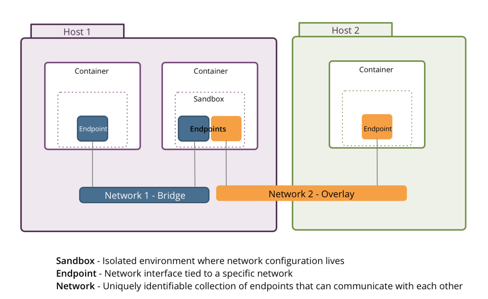

## Docker Volume

1. Volumes
   * 功能最全  created and managed by Docker
   * 可持久化 可以只读 可以填充(pre poplulate - host 到 container && container 到 host)
   * 支持volume drivers 可以持久化数据到远程host或者云服务商
   * 不指定volume自动创建时 volume为保证唯一性的随机名称，不利于复用
   * 可以创建volume 然后启动容器时挂载volume 或者 直接挂载宿主机的目录或者文件(参考docker内部call host docker的一种方法)
   * 可以使用volume container - 将volume container里面挂载的volume映射host的目录映射到volume-from的container中
   * -v 和 --mount
     * --mount 语法更加复杂 可以指定mount type例如voume bind tmpfs 
     * --mount 也支持volume-driver 比如local / vieux/sshfx(remote)
     * using volumes with services only mount is supported -- Swarm
2. Bind mounts
   * 功能次之 也可持久化 
   * 已经不推荐使用
   * 安全性不高 可以直接在container内部改变host的文件系统 - create modify delete
3. Tmpfs mounts
   * 仅限于Linux 持久化到host memory
   * 适用于lifetime内的敏感信息 或者 不需要持久化的数据


**Volumes常见命令**

```shell
docker volume create <name>
docker volume ls
docker volume rm <name>
docker volume inspect <name>
# Remove all unused local volumes
docker volume prune       

-v:
# anonymous volume
-v /containerData
# use exist volume, if my-vol not exist will create it automatilly
-v my-vol:/containerData
-v /var/host/diret:/containerData
# ro means readyonly
-v /var/host/diret:/containerData:ro
# use volume container as volume
--volumes-from 

--mount:
--mount source=my-vol,target=/containerData,type=volume,volume-driver=local


```

## Docker Network

**Network 常见命令**

```shell
docker network 
	connect     Connect a container to a network
    create      Create a network
    disconnect  Disconnect a container from a network
    inspect     Display detailed information on one or more networks
    ls          List networks
    prune       Remove all unused networks
    rm          Remove one or more networks
```

本质是利用iptables做转发 — 端口 ip映射

启动Docker时会在主机上创建一个名为docker0的虚拟网桥接口

> 网桥 docker0 通过 iptables 中的配置与宿主机器上的网卡相连，所有符合条件的请求都会通过 iptables 转发到 docker0 并由网桥分发给对应的机器
>
> `iptables -t nat -L`
>
> 我们在当前的机器上使用 docker run -d -p 6379:6379 redis 命令启动了一个新的 Redis 容器，在这之后我们再查看当前 iptables 的 NAT 配置就会看到在 DOCKER 的链中出现了一条新的规则
>
> 该规则会将从任意源发送到当前机器 6379 端口的 TCP 包转发到 192.168.0.4:6379 所在的地址上
>
> Docker 通过 Linux 的命名空间实现了网络的隔离，又通过 iptables 进行数据包转发，让 Docker 容器能够优雅地为宿主机器或者其他容器提供服务


默认情况下，容器使用私有IP地址段， 需要通过各端口暴露服务

在不同主机上的容器之间不能互相通信


**Docker默认网络** -- **docker network ls**:

1.bridge  - default network 本质是docker0的虚拟网桥

网桥相当于一个虚拟交换机，容器和docker0之间通过veth进行连接

veth相当于一根虚拟网线，连接容器和虚拟交换机。这样使得docker0与容器相连


2.host - 与host共享同一个网络 直接暴露在网络上，有一定安全隐患 

但是速度比bridge快 -- 也即是性能高，因为不需要路由转发，牺牲了灵活性。比如端口冲突，host上使用了的就不能再使用了

可以直接通过host的ip地址进行访问，因而可以用作跨host网络通信方案


3.none - 没有网络 不可与外界通信>in or out 试用于安全性较高 或者 不需要网络的container


**自定义容器网络**

user-defined网络驱动：bridge overlay macvlan

overlay 和 macvlan用于创建跨主机的网络，容器可跨主机进行通信


自定义bridge：

```shell
docker network create -d bridge --subnet 172.10.0.0/24 --gateway 172.10.0.1 my_net
```

-d bridge表示自定义网络的驱动为bridge，--subnet 172.10.0.0/24 --gateway 172.10.0.1分别指定网段和网关

> `docker network inspect my_net` -- 查看network info

> `ip l` -- 查看新创建的network对应的网桥<br-xx>

> `brctl show` -- 查看全部网桥信息。

> `docker run -it --network my_net --ip 172.10.0.3 busybox` -- 指定container的network和ip

同一个网络（默认网络或者自定义网络）下的容器之间是能ping通的，但是不同网络之间的容器由于网络独立性的要求是无法ping通的。原因是iptables-save DROP掉了docker之间的网络

Iptables --list


**如何让不同网络之间的docker通信**

1.IP通信

同一网络自然可以通信 不同网络，根据实体机我们知道需要网卡来连接到另一个网络

容器同理， 只需要为其中一个容器添加另外一个容器的网络就可以了

`docker network connect <network> <container>`

2.Docker DNS Server

IP不够灵活 因为部署应用前无法确定IP

Docker 1.10起 docker daemon内嵌了一个DNS Server 使得容器可以通过容器名称进行通信

只需要在启动时用—name为容器命名即可

```
docker run -it --network=my_net --name=bbox1 busybox
docker run -it --network=my_net --name=bbox2 busybox
```

此时，bbox1 与 bbox2 可以互相ping通

Docker DNS只能在user-defined网络中使用，默认bridge无法使用

3.joined容器

使得两个或多个容器共享一个网络栈 共享网卡和配置信息

joined容器之间可以通过127.0.0.1直接通信


先创建一个httpd容器，名字为web1

```
docker run -d -it --name=web httpd
```

然后创建busybox容器并通过--network=container:web指定jointed容器为web1：

```
docker run -it --network=container:web busybox
```

这样busybox和web的网卡mac地址与IP完全一样，它们共享了相同的网络栈。busybox 可以直接用127.0.0.1访问web的http服务

其实也很容易理解，之前的--network参数指定了默认网络或者自定义网络，而此处是指定了一个容器，那么当然意思就是使用这个容器的网络


joined 容器非常适合以下场景：

1. 不同容器中的程序希望通过loopback高效快速地通信，比如web server与app server。
2. 希望监控其他容器的网络流量，比如运行在独立容器中的网络监控程序。

即：既需要独立 又 需要两个容器网络高度一致的场景


**容器访问外部网络**：

容器默认是能访问外部网络的。通过NAT，docker实现了容器对外网（此处外网不一定是互联网）的访问

**外部网络访问容器**：

通过端口映射的方式实现外部网络访问容器，即通过-p参数实现将容器的端口映射到外部端口


**跨主机网络**

解决方案有：docker原生的overlay 和 macvlan

第三方解决方案 常用的包括 flannel weave 和 calico


docker 通过 libnetwork 中的 CNM 将上述各种方案与docker集成在一起。

libnetwork 是 docker 容器网络库，最核心的内容是其定义的 Container Network Model (CNM)，这个模型对容器网络进行了抽象，由以下三类组件组成：

1.Sandbox

2.Endpoint

3.Network

Sandbox即是隔离container的网络 里面包含多个Endpoint

Endpoint用于将Sandbox接入网络，典型实现是veth pair

一个Endpoint只能属于一个Sandbox和一个Network

Network包含一组Endpoint，将它们连接到一起。同一network下的endpoint可以直接通信

Network的实现可以是Linux Bridge VLAN等




Docker overlay网络的原理：

1.需要一个key-value数据库用于保存网络信息 包括 Network、Endpoint、IP 等。Consul、Etcd 和 ZooKeeper 都是 Docker 支持的 key-vlaue 软件

2.各个节点配置装有key-value数据库的节点

`--cluster-store=consul://<consul_ip>:8500 --cluster-advertise=ens3:2376`

其中 <consul_ip> 表示运行 consul 容器的节点IP。ens3为当前节点的ip地址对应的网卡，也可以直接填写ip地址

> 创建完一个overlay网络之后，通过`docker network ls`可以看到网络中不仅多了一个我们创建的 `ov_net` （类型为overlay、scope为global），还能看到一个名为 `docker_gwbridge` （类型为bridge、scope为local）。这其实就是 overlay 网络的工作原理所在
>
> 通过brctl show可以看出，每创建一个网络类型为overlay的容器，则docker_gwbridge下都会挂载一个vethxxx，这说明确实overlay容器是通过此网桥进行对外连接的
>
> 简单的说 overlay 网络数据还是从 bridge 网络`docker_gwbridge`出去的，但是由于consul的作用（记录了overlay网络的endpoint、sandbox、network等信息），使得docker知道了此网络是 overlay 类型的，这样此overlay网络下的不同主机之间就能够相互访问，但其实出口还是在docker_gwbridge网桥


Docker macvlan:

macvlan 本身是 linux kernel 模块，其功能是允许在同一个物理网卡上配置多个 MAC 地址，即多个 interface，每个 interface 可以配置自己的 IP

macvlan 本质上是一种网卡虚拟化技术，Docker 用 macvlan 实现容器网络就不奇怪了

macvlan 的最大优点是性能极好，相比其他实现，macvlan 不需要创建 Linux bridge，而是直接通过以太 interface 连接到物理网络

docker 没有为 macvlan 提供 DNS 服务 只能通过IP进行访问


Docker 核心技术及原理： http://dockone.io/article/2941


```dockerfile
docker run -d -p 8080:8080 --name=orderservice111 orderservice:v1
docker run -d -p 8081:8081 --name=userservice111 userservice:v1

docker inspect userservice111 - 172.17.0.3
docker inspect orderservice111 - 172.17.0.2

docker exec -it userservice111 sh
ping orderservice111 -- failed
ping 172.17.0.2 -- ok

docker network create -d bridge my_net
docker network ls

docker network connect my_net orderservice111
docker network connect my_net userservice111

docker inspect userservice111 - my_net
docker inspect orderservice111 - my_net

docker exec -it userservice111 sh
ping orderservice111 -- ok
ping 172.17.0.2 -- ok

nslookup orderservice111
dig +trace orderservice111

uname -a -- show the current linux verison
Cat /etc/xxx-release XX为发行版名称。如 centos-release

apk add dig

shared folder:
sudo mkdir /pcshare
sudo chmod 777 /pcshare
sudo mount -t vboxsf Dockerfile /pcshare

```


